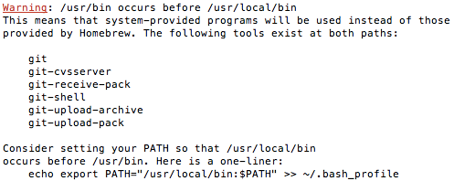
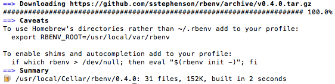
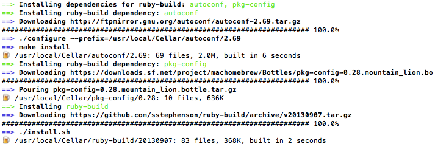

# Mac Setup for Rails Development: Doing it Right

This is an opinionated guide to getting a Rails dev environment setup quickly on a Mac. This is written assuming you have Lion (10.7+) or later as your operating system.
If you have the choice, always choose a Mac for your dev environment. It's just easier. Linux is okay too.

I'm writing this guide to help new-ish developers setup a clean system. If you already have some of this software installed, you'll have to adjust accordingly. If you use RVM or MacPorts, you'll need to fully uninstall those before continuing as they're incompatible with rbenv and HomeBrew, which are my preferred tools.

This guide assumes that you're using bash shell, which is the default shell for the OS X Terminal.app. I also assume that you use .bash_profile to setup PATH and other environment variables. If you use a different bash config file, be sure to substitute it where appropriate below.

## Preflight

Download and install (make sure to drag the app into to the Applications folder before running it) [Sublime Text 2](http://www.sublimetext.com/2). This is the text editor of choice for discerning, good-looking individuals.


## XCode and Developer Tools

Install the latest [XCode](https://developer.apple.com/xcode/). **Make sure to also install command line tools, which is an option during the install process**.


## HomeBrew

[HomeBrew](http://brew.sh/) is a package manager for OS X, which we'll use to install our command-line applications. It's a much more convenient alternative to compiling the code ourselves from source (or using MacPorts).

To install HomeBrew, copy, paste and run the following at the command line:
```
ruby -e "$(curl -fsSL https://raw.github.com/Homebrew/homebrew/go/install)"
```

Then close terminal and re-open it (restart terminal).

Now run ```brew doctor``` to make sure HomeBrew installed correctly. You should see something like this:



This is a problem. Let's fix this by moving the bin directory that HomeBrew sets up for us ahead of every other folder specified in PATH. Run the following:

```
echo export PATH='/usr/local/bin:$PATH' >> ~/.bash_profile
```
This will create a .bash_profile config file which is read and executed each time a new terminal is opened. To apply changes made to this file, you can either restart terminal (ghetto mode), or run ```source ~/.bash_profile```.

Test this out by installing wget via HomeBrew: ```brew install wget```.
Now run ```brew update``` to get the latest HomeBrew formulas.


### An Aside: Why PATH Order is Important

Command-line executables are searched by going through each folder in the PATH variable, one by one in the order listed. As soon as an app with the same name is found, it stops searching the rest of the folders. OS X comes with built-in apps (and you might have your own apps installed prior to this), but we often want to use newer versions instead. To make sure the newer version gets 'picked up', we need to ensure that the symlinked HomeBrew /bin folder comes before other system folders. To see the PATH directories, run ```echo $PATH```.

HomeBrew packages are downloaded and installed in /usr/local/Cellar/ by default, and symlinked into /usr/local/bin. This folder will not be overriden the next time Apple
releases an incremental feline update.

### Food for Thought

* How do I get a list of homebrew packages that are installable?
* How do I get a list of currently installed homebrew packages?
* How do I update an existing package?

## Git

git comes with OS X but it's typically an older version. Let's get a newer one.

```
brew install git
```

Then run ```git --version```. The version should be > 1.8.

## Installing Sublime Text 2 for the Command Line
[http://www.sublimetext.com/docs/2/OS X_command_line.html](https://www.sublimetext.com/docs/2/osx_command_line.html)

Sublime Text 2 comes with a command-line app called ```subl```. We're going to install this in the homebrew bin directory instead of ~/bin as stated on the sublime text website.
```
ln -s "/Applications/Sublime Text 2.app/Contents/SharedSupport/bin/subl" /usr/local/bin/subl
```

Now we can open up files (and folders!) from the command line using
```
subl name_of_file_or_folder
```

## rbenv
```
brew install rbenv
```



This installs [rbenv](https://github.com/sstephenson/rbenv), a lightweight tool to manage different versions of Ruby. OS X comes with an old version of Ruby, but we'll generally want to have our own, newer versions of it.

### ruby-build

Let's install [ruby-build](https://github.com/sstephenson/ruby-build), a plugin for rbenv to conveniently install different versions of Ruby.

```
brew install ruby-build
```


Now we need to modify our bash config. Open up bash_profile ```subl ~/.bash_profile``` and add the following to the end of the file and save:

```
eval "$(rbenv init -)"
```

Then either restart Terminal or run ```source ~/.bash_profile``` to apply the changes.

If you look at your path (```echo $PATH```) you should see that reloading your config has inserted .rbenv/shims to the beginning of your $PATH variable. This is necessary for rbenv to work its magic.

## Installing Ruby

To install ruby 2.1.0 (substitute this for the latest recommended version of ruby indicated on the [Rails website](http://rubyonrails.org/download)):
```
rbenv install 2.1.0
```

This may take some time. Go get a coffee. I like [Stumptown](http://stumptowncoffee.com/). You can install other rubies (different versions of ruby) this way as well.

After this finishes, you can setup your global (default) Ruby:
```
rbenv global 2.1.0
```

Note that you can override this global setting per project. See [Choosing the Ruby Version](https://github.com/sstephenson/rbenv#choosing-the-ruby-version) for more information.

## RubyGems

RubyGems is a package management framework for Ruby. It ships with Ruby 2.0.0+. We use it to install Ruby apps such as Rails. If you need to install this manually, see [http://rubygems.org/pages/download](http://rubygems.org/pages/download).

Run ```gem update --system``` to update to the latest version.

## Postgres

PostgreSQL is awesome. Prefer it over MySQL if you have the choice. The easiest way to install this is via [Postgres.app](http://postgresapp.com/). Download it, drag it to the applications folder, and then double-click to launch. While it's open, the database server is running (it adds an elephant icon to your taskbar). When you close it, the database server shuts down.

After you install the app, follow the 'Command-Line Tools' section in the [documentation](http://postgresapp.com/documentation/) to make sure your PATH contains a reference to this app. Otherwise you'll be using the default one that ships with your version of OSX.


## Installing Rails locally

You need to have Rails locally in order to create new Rails projects. After the project is created (or if you're working with an existing Rails project), you'll be using the bundled versions of Rails specific to your project.

To get the latest stable version of Rails:
```
gem install rails
```

Never run sudo in front of these gem commands, or it may install to the wrong folder.

You can look at your gems using ```gem list```. Verify that Rails is there and that the version is 4.0.0 or greater.

Now run ```source ~/.bash_profile``` so that rails is visible.


### Making a New Rails Project
By default any Rails commands now will use the latest version of Rails. Sometimes you'll have to use Rails 3 though.

To make a new Rails 4 project, ```cd``` into your projects folder:
```
rails new my_awesome_app
```

then run ```bundle exec rails server```. Visit ```http://localhost:3000``` in your browser. If you see the welcome page, congrats – Rails works!

## GitHub Setup

Now you'll need to setup Git for GitHub. GitHub has some good documentation on how to do this:

[Set up Git](https://help.github.com/articles/set-up-git#set-up-git)

[Generating SSH Keys](https://help.github.com/articles/generating-ssh-keys) - this is so you don't have to type your password every time you push.

I prefer to setup SSH keys instead of using https.
